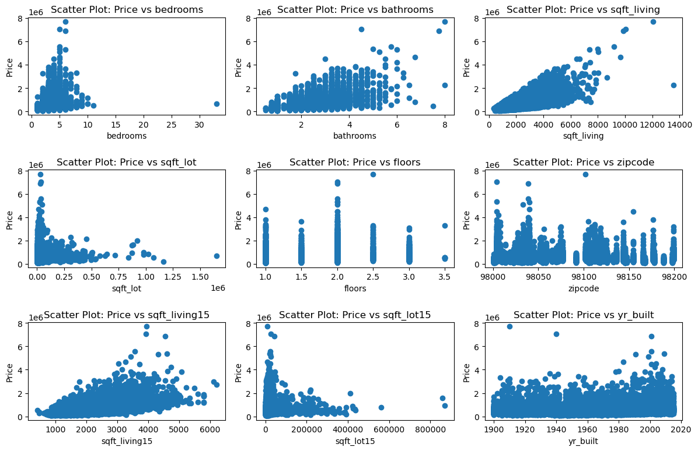
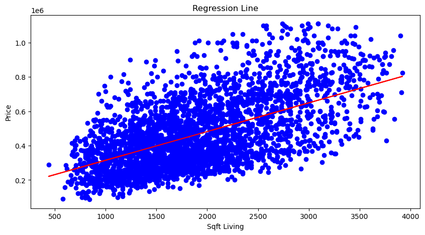
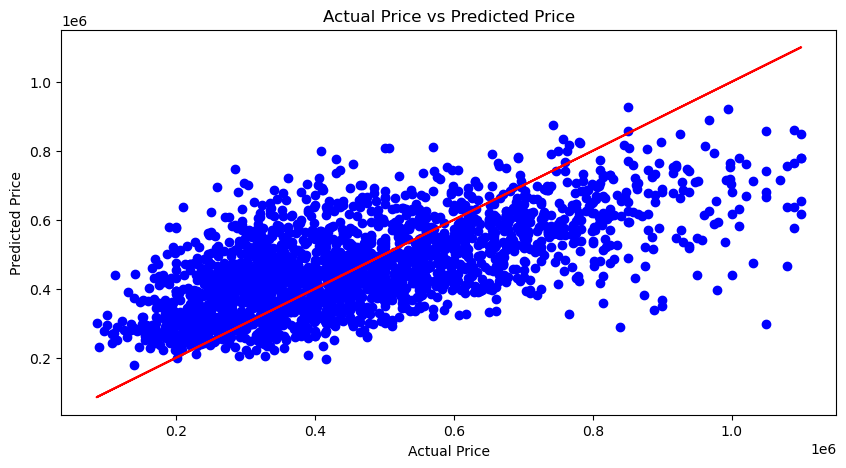

# Project Name: NorthWest County Housing Analysis

## Overview

The real estate market in a northwestern county is experiencing unpredictable fluctuations in property prices. This uncertainty makes it difficult for real estate professionals, potential buyers, and developers to make informed decisions about buying, selling, or investing in property. This study analyzes the northwestern county real-estate market.
The Stakeholders of this study are Real Estate Agencies who are responsible for representing homeowners and potential buyers' interest.

## Business problem / Challenges

The fluctuating real estate market in a northwestern county is making it challenging for real estate agents, homebuyers,homeowners, and property developers in the following ways:

Real estate agents - Because of the volatile market, it is challenging to appropriately value properties and advice customers on competitive pricing tactics.

Home-buyers - Uncertainty in making informed decisions due to unpredictable market trends and potential overpricing of properties.

Homeowners - Challenges in maximizing their return on investment by figuring out the best moment to sell their property, considering the volatility of the market.

Property developers - The fluctuation of land prices and the unpredictability of the market demand for new properties make it challenging to evaluate the viability of development projects.

## Proposed Solution

To better understand the factors that influence house sales and forecast future trends, a comprehensive analysis using multiple linear regression modeling is required. This model will analyzze historical data about the northwestern county market and allows the real estate agencies to  make informed decisions for their business and their clients.

## Conclusion

The difficulties encountered by different parties in the volatile real estate market in the northwest county have been identified by this study. The proposed solution, a linear regression model for house price prediction, aims to empower real estate agencies with valuable insights. By leveraging this model, agencies can guide their clients towards informed decisions in this uncertain market.

## Problem Statement

 The unpredictable fluctuations in property prices within the northwestern county are making it challenging for our agency to accurately advise clients on buying, selling, or investing in real estate. This uncertainty can lead to missed opportunities for both buyers and sellers, potentially hindering the agency's ability to secure successful transactions and maximize client satisfaction. The agency needs to find an informed way to provide advice to homeowners on finding the best price their client can sell their house at.

## Objectives

1. To analyze the King County House Sales dataset to identify statistically significant features that impact house prices, by utilizing  techniques such as correlation analysis.
1. To develop a simple linear regression model as the base model to predict house prices in northwestern county based on relevant features.
1. To build a multiple linear regression model that predicts the target variable, price,  whose coefficients are easily interpretable
1. To compare the performance of the multiple linear regression model with the simple linear model
1. To evaluate the model's accuracy and performance of the linear regression model using appropriate metrics such as mean squared error (MSE) or R-squared.

## Source of Data

The dataset used for this analysis is the King County House Sales dataset, which contains information on house sales in King County, Washington, USA, between May 2014 and May 2015. The dataset includes features such as house prices, square footage, number of bedrooms and bathrooms, and location details. The dataset is publicly available and can be accessed from the King County House Sales dataset repository.

## Visualizations

Include three visualizations that were presented in the slides and notebook. Provide a brief description for each visualization.

a. Visualization 1: Correlation between Features and House Prices

This visualization shows the correlation between features such as square footage, number of bedrooms, and number of bathrooms with house prices. It helps identify the relationship between these features and house prices, providing insights into the factors that influence house prices in the northwestern county real estate market.

b. Visualization 2: Regression Line Showing Relationship between Price and Square Footage

This visualization shows the regression line that represents the relationship between house prices and square footage. It helps visualize the linear relationship between these two variables and provides a clear understanding of how changes in square footage impact house prices in the northwestern county real estate market.

c.Visualization 3: Regression Line Showing the Relationship between Predicted Price and Actual Price For the Final Model

This visualization shows the regression line that represents the relationship between predicted house prices and actual house prices. It helps evaluate the accuracy of the linear regression model in predicting house prices and provides insights into the model's performance in the northwestern county real estate market.

## Conclusion

The final model, which involves multiple linear regression after feature selection, demonstrates a good balance of predictive power, accuracy, and stability. With an R-squared of 0.431, the model explains approximately 43.1% of the variance in "price," indicating a moderate level of explanatory power. The Root Mean Squared Error (RMSE) of 152268.54 suggests that while the model is reasonably accurate, there is still room for improvement in terms of prediction error.

The statistically significant predictors in this model include:

- *bedrooms*: A negative coefficient suggests that more bedrooms correlate with a lower price, which could be due to complex interactions or other factors.
- *bathrooms*: A positive coefficient indicates that more bathrooms typically result in a higher price.
- *sqft_living*: The positive coefficient confirms that a larger living area tends to increase price.
- *sqft_lot*: A negative coefficient suggests diminishing returns from larger lot sizes.
- *floors*: More floors generally lead to higher prices.
- *build_age*: Newer properties (lower build_age) tend to be more valuable.

Despite its strengths, the model's high condition number (64000) suggests potential multicollinearity or numerical instability, which could affect the reliability of the results. Additionally, diagnostic tests indicate that the residuals might not be normally distributed, hinting at potential issues with model assumptions.

## Trello Link
[text](https://trello.com/b/JTac8Mqq/phase-2-group-project)